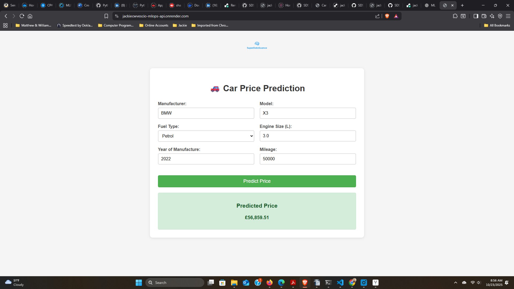

# 🚀 Car Price Prediction – Deployment Report (JCWV)

## Live Demo
- **Web App:**  
  [Car Price Prediction (Render)](https://jackiecwvescio-mlops-api.onrender.com/)

---

## Project Deployment Overview

This project demonstrates an end-to-end MLOps deployment pipeline:
- **Backend:** FastAPI app serving a pre-trained car price prediction model
- **Frontend:** Custom HTML form for user-friendly input (index.html)
- **Containerization:** Docker for reproducible builds
- **Cloud Hosting:** Render (free tier) for live web service

---

## How It Works

1. **User Input:**  
   - Enter car details (make, model, year, etc.) in a simple web form.
2. **Prediction:**  
   - Form submits data to the FastAPI backend (`/predict`) via AJAX.
3. **Result:**  
   - Predicted car price is instantly displayed in the browser.

---

## API Endpoints

- `/` — Loads the HTML web interface
- `/predict` — Accepts POST request with car features (returns predicted price)
- `/health` — Health check endpoint for deployment monitoring

---

## Deployment Instructions

### Run Locally

```bash
pip install -r requirements.txt
uvicorn main:app --reload
# Open browser to http://127.0.0.1:8000/

Run with Docker
docker build -t car-price-predictor .
docker run -p 8000:8000 car-price-predictor

Render Cloud Deployment
GitHub Repo: SDS-CP040-modelops
Service: Deployed as a Web Service on Render
Static Files: /static contains logo and index.html
Model: model.pkl is loaded at startup```



Decision not to use AWS:
For security and privacy reasons, I prefer not to submit billing or credit card info to AWS at this time. My deployment is live and fully functional on Render, which meets the project requirements for cloud-based model serving. Thank you for your understanding. 

